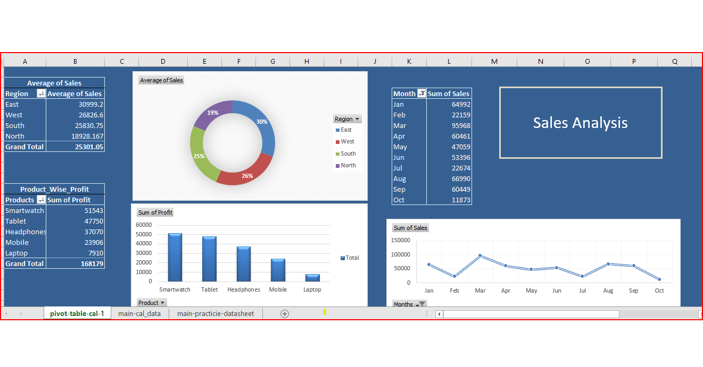

# 📊 Excel Sales Analytics Project  

## 🔹 Project Overview  
This project demonstrates **end-to-end Excel data analysis** using a sample sales dataset.  
It covers **basic to advanced calculations, PivotTables, and dashboarding** to derive business insights.  

## 🔹 Dataset  
- 20 sample sales transactions  
- Fields: OrderID, Product, Category, Region, Sales, Quantity, Discount, Profit, OrderDate  

## 🔹 Key Excel Skills Applied  
✅ Formulas: SUM, AVERAGE, COUNTIF, MAX, IF, RANK, SUMIFS, LARGE  
✅ PivotTables: Region-wise, Product-wise, Month-wise analysis  
✅ Profitability analysis using **Profit Margin %**  
✅ Dynamic Dashboard creation with charts (Pie, Column, Line)  

## 🔹 Business Insights  
📌 West region had the **highest number of orders**.  
📌 Laptops contributed the most to **overall profit**.  
📌 March showed a noticeable **spike in sales**.  
📌 Profit margins varied significantly by region, with **North leading in efficiency**.  
📌 Discounts had a visible **impact on profitability** — higher discounts reduced margins.  

## 🔹 Dashboard Snapshot  

## 🔹 How to Use  
1. Download the Excel file from this repository.  
2. Explore PivotTables and dashboards.  
3. Try solving the included **practice problems** to improve Excel skills.

## 📊 Excel Practice Problems & Solutions
## 🔹 Basic Level  

1. **Find the total sales**  
👉 `=SUM(E2:E21)`  
✔ Returns the total of the Sales column.  

2. **Find the average profit**  
👉 `=AVERAGE(H2:H21)`  
✔ Returns the average of the Profit column.  

3. **Find the highest sales value**  
👉 `=MAX(E2:E21)`  

4. **Count how many orders were from the "West" region**  
👉 `=COUNTIF(D2:D21,"West")`  

5. **Count how many orders were for "Laptop"**  
👉 `=COUNTIF(B2:B21,"Laptop")`  

---

## 🔹 Intermediate Level  

6. **Calculate total sales after discount for each order**  
👉 New column formula: `=E2-(E2*G2/100)`  

7. **Find average sales by region**  
👉 PivotTable → Rows: Region, Values: Average of Sales  

8. **Find which product generated the highest profit**  
👉 PivotTable → Rows: Product, Values: Sum of Profit → Sort descending  

9. **Calculate total profit margin % for all orders**  
👉 `=SUM(H2:H21)/SUM(E2:E21)`  

---

## 🔹 Advanced Level  

10. **Calculate Profit Margin % for each order**  
👉 New column formula: `=H2/E2`  

11. **Find month-wise total sales trend**  
👉 Use: `=TEXT(I2,"MMM-YYYY")` → PivotTable by Month → Sum of Sales  

12. **Find top 3 highest sales orders**  
👉 `=LARGE(E2:E21,{1,2,3})`  

13. **Identify which month had the highest sales**  
👉 Add column `=TEXT(I2,"MMM-YYYY")` → PivotTable by Month → Max Sales  

14. **Calculate total sales per region per month**  
👉 PivotTable → Rows: Region, Columns: Month, Values: Sum of Sales  

15. **Find average discount by product**  
👉 PivotTable → Rows: Product, Values: Average of Discount  

16. **Create a dynamic dashboard with:**  
- 📊 Pie Chart → Sales by Region  
- 📊 Column Chart → Profit by Category  
- 📊 Line Chart → Monthly Sales Trend  

---

## 🔹 Expert Level (Real-World Thinking)  

17. **Find which region gives the best profit margin**  
👉 Add Profit Margin column: `=H2/E2` → PivotTable by Region → Average of Margin  

18. **Which product is most sensitive to discount (discount ↑ → profit ↓)?**  
👉 Scatter chart: Discount vs Profit → Look for steep negative trend  

19. **Calculate Year-to-Date (YTD) sales**  
👉 `=SUMIFS(E:E,I:I,"<="&TODAY())`  

20. **Create a formula to find orders above the average sales**  
👉 `=IF(E2>AVERAGE($E$2:$E$21),"Above Avg","Below Avg")`  

21. **Rank products based on sales**  
👉 `=RANK(E2,$E$2:$E$21,0)`  

---
